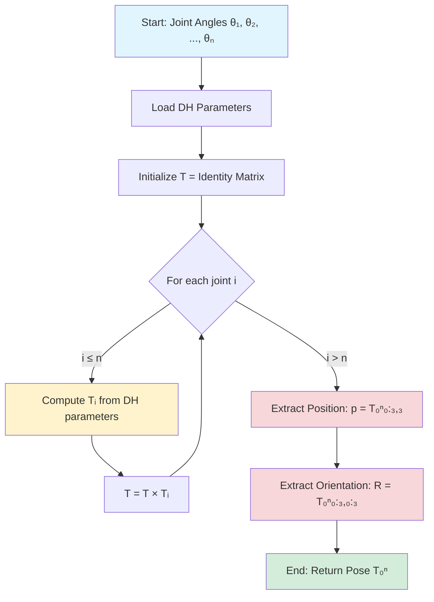

# Kinematics

## Introduction to Kinematics

Kinematics is the study of motion without considering the forces that cause it. In robotics, kinematics focuses on the geometric relationships between joint angles and the position and orientation of robot links. For humanoid robots, understanding kinematics is essential for tasks like reaching, grasping, walking, and maintaining balance.

At the heart of kinematic analysis are **coordinate frames**—reference systems attached to each link of the robot. These frames allow us to precisely describe the position and orientation of each part of the robot relative to a base reference frame. **Homogeneous transformations** are 4×4 matrices that combine rotation and translation into a single mathematical operation, enabling us to chain transformations from one link to the next.

Why does kinematics matter for humanoid robots? Consider a humanoid reaching for an object. The robot's control system must compute which joint angles will position the hand at the desired location—this is inverse kinematics. Conversely, given current joint positions from sensors, the system must determine where the hand actually is—this is forward kinematics. Both problems are fundamental to robot control.

Humanoid robots typically have many degrees of freedom (DOF)—arms with 6-7 DOF each, legs with 6 DOF each, plus torso and head joints. This complexity makes systematic approaches like the Denavit-Hartenberg convention invaluable for organizing and solving kinematic problems.

## Forward Kinematics

### Denavit-Hartenberg (DH) Parameter Convention

Forward kinematics answers the question: "Given all joint angles, where is the end-effector?" The Denavit-Hartenberg (DH) convention provides a systematic method to answer this question by describing the geometry of serial robot manipulators using just four parameters per link.

**The Four DH Parameters:**

1. **Link length (a)**: Distance along the common normal between successive joint axes
2. **Link twist (α)**: Angle between successive joint axes measured about the common normal
3. **Link offset (d)**: Distance along the joint axis from one link to the next
4. **Joint angle (θ)**: Angle about the joint axis (variable for revolute joints)

For each link $i$, the transformation from frame $i-1$ to frame $i$ is given by:

$$
T_i = \begin{bmatrix}
\cos\theta_i & -\sin\theta_i\cos\alpha_i & \sin\theta_i\sin\alpha_i & a_i\cos\theta_i \\
\sin\theta_i & \cos\theta_i\cos\alpha_i & -\cos\theta_i\sin\alpha_i & a_i\sin\theta_i \\
0 & \sin\alpha_i & \cos\alpha_i & d_i \\
0 & 0 & 0 & 1
\end{bmatrix}
$$

The complete transformation from the base frame to the end-effector is obtained by multiplying these individual transformations:

$$
T_{0}^{n} = T_1 \cdot T_2 \cdot T_3 \cdots T_n
$$

**Forward Kinematics Algorithm:**



**DH Parameter Table Example** (2-DOF Planar Arm):

| Link | $a$ | $\alpha$ | $d$ | $\theta$ |
|------|-----|----------|-----|----------|
| 1    | $l_1$ | 0 | 0 | $\theta_1$ (variable) |
| 2    | $l_2$ | 0 | 0 | $\theta_2$ (variable) |

### Example: 2-DOF Planar Arm

Consider a simple 2-link planar robot arm operating in the x-y plane. Both joints are revolute (rotating), and the links have lengths $l_1$ and $l_2$.


*Figure 2.1: A 2-DOF planar arm with coordinate frames and joint angles labeled*

**Forward Kinematics Derivation:**

For the first joint:
$$
x_1 = l_1 \cos\theta_1, \quad y_1 = l_1 \sin\theta_1
$$

For the end-effector (tip of link 2):
$$
x = l_1 \cos\theta_1 + l_2 \cos(\theta_1 + \theta_2)
$$
$$
y = l_1 \sin\theta_1 + l_2 \sin(\theta_1 + \theta_2)
$$

**Python Implementation:**

```python
import numpy as np

def forward_kinematics_2dof(theta1, theta2, l1, l2):
    """
    Compute forward kinematics for a 2-DOF planar arm.

    Parameters:
    -----------
    theta1 : float
        Joint 1 angle in radians
    theta2 : float
        Joint 2 angle relative to link 1, in radians
    l1 : float
        Length of link 1
    l2 : float
        Length of link 2

    Returns:
    --------
    x, y : float
        End-effector position in Cartesian coordinates
    """
    x = l1 * np.cos(theta1) + l2 * np.cos(theta1 + theta2)
    y = l1 * np.sin(theta1) + l2 * np.sin(theta1 + theta2)
    return x, y

# Example usage
theta1 = np.pi / 4  # 45 degrees
theta2 = np.pi / 6  # 30 degrees
l1, l2 = 1.0, 0.8   # meters

x, y = forward_kinematics_2dof(theta1, theta2, l1, l2)
print(f"End-effector position: ({x:.3f}, {y:.3f})")
# Output: End-effector position: (1.369, 1.207)
```

This simple example demonstrates the core concept: joint angles map to Cartesian positions through trigonometric functions.

### Example: 6-DOF Humanoid Arm

A humanoid arm typically has 6 degrees of freedom: 3 at the shoulder (pitch, roll, yaw), 1 at the elbow, and 2 at the wrist. This configuration provides full 6-DOF positioning and orientation of the hand in 3D space.


*Figure 2.2: A 6-DOF humanoid arm showing all joint axes and DH coordinate frames*

**Typical DH Parameters for Humanoid Arm:**

| Joint | $a$ | $\alpha$ | $d$ | $\theta$ | Description |
|-------|-----|----------|-----|----------|-------------|
| 1 | 0 | 90° | $d_1$ | $\theta_1$ | Shoulder yaw |
| 2 | 0 | -90° | 0 | $\theta_2$ | Shoulder pitch |
| 3 | $a_3$ | 0 | 0 | $\theta_3$ | Shoulder roll |
| 4 | $a_4$ | 90° | 0 | $\theta_4$ | Elbow |
| 5 | 0 | -90° | $d_5$ | $\theta_5$ | Wrist pitch |
| 6 | 0 | 0 | $d_6$ | $\theta_6$ | Wrist yaw |

**Python Implementation:**

```python
import numpy as np

def dh_transform(a, alpha, d, theta):
    """
    Compute DH transformation matrix for a single joint.

    Parameters:
    -----------
    a : float
        Link length
    alpha : float
        Link twist (radians)
    d : float
        Link offset
    theta : float
        Joint angle (radians)

    Returns:
    --------
    T : ndarray (4x4)
        Homogeneous transformation matrix
    """
    ct, st = np.cos(theta), np.sin(theta)
    ca, sa = np.cos(alpha), np.sin(alpha)

    return np.array([
        [ct, -st*ca,  st*sa, a*ct],
        [st,  ct*ca, -ct*sa, a*st],
        [0,   sa,     ca,    d],
        [0,   0,      0,     1]
    ])

def forward_kinematics_6dof(joint_angles, dh_params):
    """
    Compute forward kinematics for a 6-DOF arm using DH parameters.

    Parameters:
    -----------
    joint_angles : array-like (6,)
        Joint angles in radians [θ1, θ2, θ3, θ4, θ5, θ6]
    dh_params : array-like (6, 4)
        DH parameters [a, alpha, d] for each joint
        (theta is variable and comes from joint_angles)

    Returns:
    --------
    T : ndarray (4x4)
        Transformation from base to end-effector
    """
    T = np.eye(4)

    for i, theta in enumerate(joint_angles):
        a, alpha, d = dh_params[i]
        T = T @ dh_transform(a, alpha, d, theta)

    return T

# Example DH parameters (simplified humanoid arm)
dh_params = np.array([
    [0,    np.pi/2,  0.1],   # Shoulder yaw
    [0,   -np.pi/2,  0],     # Shoulder pitch
    [0.3,  0,        0],     # Shoulder roll
    [0.3,  np.pi/2,  0],     # Elbow
    [0,   -np.pi/2,  0.1],   # Wrist pitch
    [0,    0,        0.05],  # Wrist yaw
])

# Example joint configuration
joint_angles = np.array([0, np.pi/4, 0, np.pi/3, 0, 0])

T_end = forward_kinematics_6dof(joint_angles, dh_params)
position = T_end[:3, 3]
print(f"End-effector position: {position}")
print(f"End-effector orientation:\n{T_end[:3, :3]}")
```

This implementation computes the full 6-DOF pose (position and orientation) of the hand given shoulder, elbow, and wrist joint angles.

## Inverse Kinematics

### Analytical Solutions

Inverse kinematics (IK) solves the opposite problem: "Given a desired end-effector pose, what joint angles achieve it?" This is generally more challenging than forward kinematics because:

1. **Multiple solutions** may exist (e.g., elbow-up vs. elbow-down configurations)
2. **No solution** may exist if the target is outside the workspace
3. **Closed-form solutions** exist only for certain geometric configurations

For our 2-DOF planar arm, we can derive an analytical solution:

Given target position $(x_d, y_d)$, we need to find $\theta_1$ and $\theta_2$.

**Law of Cosines Approach:**

$$
\cos\theta_2 = \frac{x_d^2 + y_d^2 - l_1^2 - l_2^2}{2 l_1 l_2}
$$

$$
\theta_2 = \pm \arccos\left(\frac{x_d^2 + y_d^2 - l_1^2 - l_2^2}{2 l_1 l_2}\right)
$$

The $\pm$ indicates two solutions (elbow-up and elbow-down). Then:

$$
\theta_1 = \arctan2(y_d, x_d) - \arctan2(l_2 \sin\theta_2, l_1 + l_2 \cos\theta_2)
$$

**Key Insight:** For manipulators with 6 DOF and special geometric properties (like a spherical wrist), closed-form solutions can be derived by decoupling position and orientation.

### Numerical Methods

For complex manipulators without closed-form solutions, numerical methods are essential.

**Jacobian-Based Methods:**

The Jacobian matrix $J$ relates joint velocities to end-effector velocities:

$$
\dot{x} = J(\theta) \dot{\theta}
$$

For IK, we can iteratively update joint angles:

$$
\Delta\theta = J^{-1} \Delta x
$$

where $\Delta x$ is the error between current and desired positions.

**Optimization-Based Methods:**

Formulate IK as an optimization problem:

$$
\min_\theta \| f(\theta) - x_d \|^2
$$

subject to joint limit constraints: $\theta_{\min} \leq \theta \leq \theta_{\max}$

### Example: Reaching Task

```python
import numpy as np
from scipy.optimize import minimize

def forward_kinematics_2dof(theta, l1, l2):
    """Forward kinematics returning position as array."""
    x = l1 * np.cos(theta[0]) + l2 * np.cos(theta[0] + theta[1])
    y = l1 * np.sin(theta[0]) + l2 * np.sin(theta[0] + theta[1])
    return np.array([x, y])

def inverse_kinematics_2dof(target, l1, l2, initial_guess=None):
    """
    Solve inverse kinematics using numerical optimization.

    Parameters:
    -----------
    target : array-like (2,)
        Desired end-effector position [x, y]
    l1, l2 : float
        Link lengths
    initial_guess : array-like (2,), optional
        Initial joint angles [θ1, θ2]

    Returns:
    --------
    theta : ndarray (2,)
        Joint angles that achieve target position
    """
    if initial_guess is None:
        initial_guess = np.array([0.0, 0.0])

    def objective(theta):
        """Minimize distance to target."""
        current_pos = forward_kinematics_2dof(theta, l1, l2)
        return np.sum((current_pos - target)**2)

    # Joint limits: -π to π
    bounds = [(-np.pi, np.pi), (-np.pi, np.pi)]

    result = minimize(objective, initial_guess, bounds=bounds, method='SLSQP')

    if result.success:
        return result.x
    else:
        raise ValueError("IK solution not found")

# Example: Reach to position (1.5, 0.5)
target = np.array([1.5, 0.5])
l1, l2 = 1.0, 0.8

try:
    joint_angles = inverse_kinematics_2dof(target, l1, l2)
    print(f"IK solution: θ1 = {np.degrees(joint_angles[0]):.2f}°, "
          f"θ2 = {np.degrees(joint_angles[1]):.2f}°")

    # Verify solution
    achieved_pos = forward_kinematics_2dof(joint_angles, l1, l2)
    error = np.linalg.norm(achieved_pos - target)
    print(f"Position achieved: {achieved_pos}")
    print(f"Position error: {error:.6f} m")
except ValueError as e:
    print(f"Error: {e}")
```

This optimization approach is general and can handle joint limits, obstacle avoidance constraints, and other practical considerations.

## Practical Considerations

### Joint Limits and Collision Avoidance

Real humanoid robots have physical constraints:

- **Joint limits**: Each joint has mechanical limits (e.g., shoulder pitch: -90° to 180°)
- **Self-collision**: The robot must not collide with itself (e.g., hand hitting torso)
- **Singularities**: Configurations where the robot loses degrees of freedom

**Handling Joint Limits in IK:**

```python
# Add constraints to optimization
def inverse_kinematics_with_limits(target, l1, l2, joint_limits):
    """IK solver respecting joint limits."""
    def objective(theta):
        current_pos = forward_kinematics_2dof(theta, l1, l2)
        return np.sum((current_pos - target)**2)

    # joint_limits: [(θ1_min, θ1_max), (θ2_min, θ2_max)]
    bounds = joint_limits

    result = minimize(objective, [0.0, 0.0], bounds=bounds, method='SLSQP')
    return result.x if result.success else None
```

### Workspace Analysis

The **workspace** is the set of all positions the end-effector can reach. For a 2-DOF planar arm:

- **Reachable workspace**: All points within distance $l_1 + l_2$ of the base
- **Dexterous workspace**: Points reachable with multiple configurations

Understanding workspace is crucial for task planning—you can't command the robot to reach outside its physical capability.

### Integration with Motion Planning

Kinematics is a foundation for motion planning:

1. **Path planning** generates waypoints in Cartesian space
2. **IK** converts waypoints to joint trajectories
3. **Trajectory optimization** smooths motion while respecting dynamics

Advanced frameworks like **ROS MoveIt** combine kinematics, collision checking, and trajectory planning into a unified system for humanoid manipulation.

---

**Summary:** Forward kinematics maps joint angles to end-effector poses using systematic methods like DH parameters. Inverse kinematics solves for joint angles given desired poses, using either analytical solutions (when available) or numerical optimization. These tools are fundamental for controlling humanoid arms, enabling tasks from simple reaching to complex manipulation.

**Next:** In the [Dynamics](./dynamics.md) section, we'll extend this kinematic foundation by incorporating forces and torques to understand how humanoid robots actually move.
