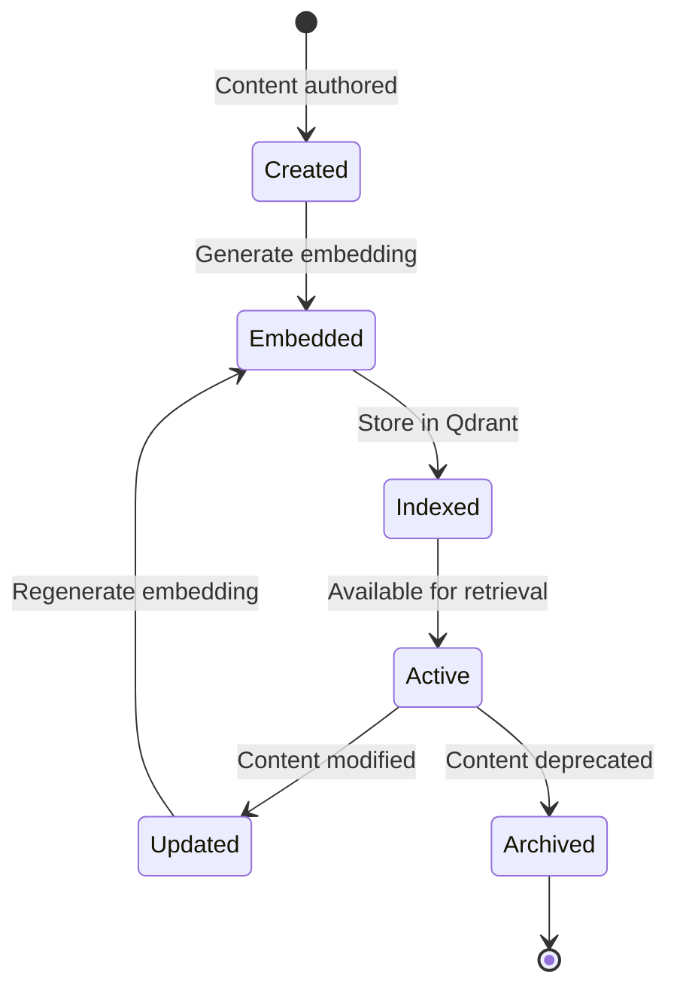
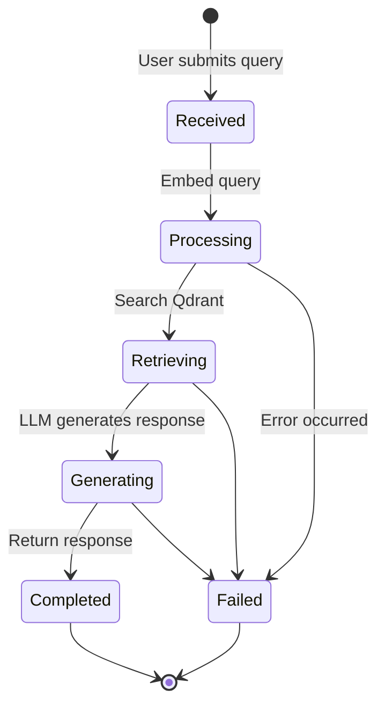

# Data Model: Humanoid Robotics Chapter 2

**Feature**: Humanoid Robotics Chapter 2 - Kinematics & Dynamics
**Date**: 2025-11-30
**Branch**: 001-humanoid-chapter2

## Overview

This document defines the data models for Chapter 2 content storage, RAG retrieval, and chatbot interactions. Models are designed to support both the Docusaurus frontend and the FastAPI RAG backend.

---

## Content Models

### 1. Chapter

Represents a complete chapter in the textbook.

**Attributes**:
- `id` (int): Unique chapter identifier (e.g., 2 for Chapter 2)
- `title` (str): Chapter title (e.g., "Kinematics and Dynamics")
- `slug` (str): URL-friendly identifier (e.g., "kinematics-dynamics")
- `order` (int): Display order in textbook navigation
- `description` (str): Brief chapter overview (1-2 sentences)
- `learning_outcomes` (list[str]): List of learning objectives
- `prerequisites` (list[int]): IDs of prerequisite chapters
- `estimated_time` (int): Estimated reading time in minutes
- `sections` (list[Section]): Ordered list of sections
- `created_at` (datetime): Creation timestamp
- `updated_at` (datetime): Last modification timestamp

**Validation Rules**:
- `id` must be positive integer
- `title` must be 3-100 characters
- `slug` must match pattern `[a-z0-9-]+`
- `order` must be unique across chapters
- `learning_outcomes` must contain 3-10 items

**Example**:
```json
{
  "id": 2,
  "title": "Kinematics and Dynamics",
  "slug": "kinematics-dynamics",
  "order": 2,
  "description": "Explore the mathematical foundations of humanoid robot motion and forces.",
  "learning_outcomes": [
    "Define forward and inverse kinematics for humanoid arms",
    "Apply DH parameters to describe robot geometry",
    "Calculate forces and torques in humanoid robot systems",
    "Analyze stability using Zero Moment Point (ZMP)"
  ],
  "prerequisites": [1],
  "estimated_time": 45,
  "sections": [...],
  "created_at": "2025-11-30T10:00:00Z",
  "updated_at": "2025-11-30T10:00:00Z"
}
```

---

### 2. Section

Represents a major section within a chapter.

**Attributes**:
- `id` (str): Unique section identifier (e.g., "ch2-kinematics")
- `chapter_id` (int): Parent chapter ID
- `title` (str): Section title (e.g., "Forward Kinematics")
- `slug` (str): URL-friendly identifier (e.g., "forward-kinematics")
- `order` (int): Display order within chapter
- `content` (str): Full section content in Markdown/MDX
- `subsections` (list[Subsection]): Ordered list of subsections
- `difficulty` (enum): "beginner" | "intermediate" | "advanced"
- `tags` (list[str]): Topic tags for search/filtering
- `code_examples` (list[CodeExample]): Embedded code snippets
- `diagrams` (list[Diagram]): Visual aids

**Validation Rules**:
- `title` must be 3-150 characters
- `content` must be non-empty
- `order` must be unique within chapter
- `difficulty` must be valid enum value

**Example**:
```json
{
  "id": "ch2-forward-kinematics",
  "chapter_id": 2,
  "title": "Forward Kinematics",
  "slug": "forward-kinematics",
  "order": 1,
  "content": "Forward kinematics is the process of...",
  "subsections": [...],
  "difficulty": "intermediate",
  "tags": ["kinematics", "dh-parameters", "transformation-matrices"],
  "code_examples": [...],
  "diagrams": [...]
}
```

---

### 3. Subsection

Represents a subsection within a section.

**Attributes**:
- `id` (str): Unique subsection identifier
- `section_id` (str): Parent section ID
- `title` (str): Subsection title
- `order` (int): Display order within section
- `content` (str): Subsection content in Markdown/MDX
- `anchor` (str): HTML anchor ID for deep linking

**Example**:
```json
{
  "id": "ch2-fk-dh-parameters",
  "section_id": "ch2-forward-kinematics",
  "title": "Denavit-Hartenberg Parameters",
  "order": 1,
  "content": "The DH convention defines four parameters...",
  "anchor": "dh-parameters"
}
```

---

### 4. CodeExample

Represents a code snippet embedded in content.

**Attributes**:
- `id` (str): Unique code example identifier
- `section_id` (str): Parent section ID
- `title` (str): Example title (e.g., "2-DOF Planar Arm FK")
- `language` (str): Programming language (e.g., "python", "cpp")
- `code` (str): Source code content
- `explanation` (str): Brief explanation of the code
- `runnable` (bool): Whether code can be executed in browser
- `dependencies` (list[str]): Required libraries (e.g., ["numpy", "matplotlib"])

**Example**:
```json
{
  "id": "ch2-fk-2dof-python",
  "section_id": "ch2-forward-kinematics",
  "title": "2-DOF Planar Arm Forward Kinematics",
  "language": "python",
  "code": "import numpy as np\n\ndef forward_kinematics(theta1, theta2, l1, l2):\n    ...",
  "explanation": "This function computes the end-effector position given joint angles.",
  "runnable": true,
  "dependencies": ["numpy"]
}
```

---

### 5. Diagram

Represents a visual diagram or figure.

**Attributes**:
- `id` (str): Unique diagram identifier
- `section_id` (str): Parent section ID
- `title` (str): Diagram title
- `type` (enum): "static_image" | "interactive" | "mermaid" | "latex"
- `source` (str): Diagram source (file path, Mermaid code, LaTeX, etc.)
- `alt_text` (str): Accessibility description
- `caption` (str): Figure caption

**Example**:
```json
{
  "id": "ch2-2dof-arm-diagram",
  "section_id": "ch2-forward-kinematics",
  "title": "2-DOF Planar Arm Coordinate Frames",
  "type": "static_image",
  "source": "/img/chapter2/2dof-arm.svg",
  "alt_text": "Diagram showing two-link planar arm with coordinate frames at joints",
  "caption": "Figure 2.1: Coordinate frame assignment for a 2-DOF planar arm"
}
```

---

## RAG Models

### 6. ContentChunk

Represents a semantically meaningful text chunk for RAG retrieval.

**Attributes**:
- `id` (str): Unique chunk identifier (UUID)
- `chapter_id` (int): Source chapter
- `section_id` (str): Source section
- `subsection_id` (str | null): Source subsection (if applicable)
- `text` (str): Chunk text content (500 tokens max)
- `embedding_vector` (list[float]): 1536-dimensional embedding
- `token_count` (int): Number of tokens in text
- `metadata` (dict): Additional context
  - `start_char` (int): Character offset in source document
  - `end_char` (int): End character offset
  - `difficulty` (str): Content difficulty level
  - `tags` (list[str]): Topic tags
- `created_at` (datetime): Creation timestamp

**Validation Rules**:
- `text` must be 50-2000 characters
- `embedding_vector` must have exactly 1536 dimensions
- `token_count` must match actual tokenization

**Database Schema** (Neon Postgres):
```sql
CREATE TABLE content_chunks (
    id UUID PRIMARY KEY DEFAULT gen_random_uuid(),
    chapter_id INTEGER NOT NULL,
    section_id VARCHAR(255) NOT NULL,
    subsection_id VARCHAR(255),
    text TEXT NOT NULL,
    token_count INTEGER NOT NULL,
    metadata JSONB,
    created_at TIMESTAMP DEFAULT NOW()
);

CREATE INDEX idx_chunks_chapter ON content_chunks(chapter_id);
CREATE INDEX idx_chunks_section ON content_chunks(section_id);
```

**Qdrant Schema**:
```python
from qdrant_client.models import VectorParams, Distance

collection_config = {
    "vectors": VectorParams(size=1536, distance=Distance.COSINE),
    "payload_schema": {
        "chapter_id": "integer",
        "section_id": "keyword",
        "subsection_id": "keyword",
        "text": "text",
        "difficulty": "keyword",
        "tags": "keyword[]"
    }
}
```

---

### 7. ChatQuery

Represents a user query to the RAG chatbot.

**Attributes**:
- `id` (str): Unique query identifier (UUID)
- `session_id` (str): Conversation session ID
- `user_text` (str): User's question
- `selected_context` (str | null): User-selected text from chapter (optional)
- `chapter_filter` (int | null): Limit search to specific chapter
- `timestamp` (datetime): Query timestamp

**Validation Rules**:
- `user_text` must be 3-1000 characters
- `selected_context` must be <5000 characters if provided

**Database Schema**:
```sql
CREATE TABLE chat_queries (
    id UUID PRIMARY KEY DEFAULT gen_random_uuid(),
    session_id VARCHAR(255) NOT NULL,
    user_text TEXT NOT NULL,
    selected_context TEXT,
    chapter_filter INTEGER,
    timestamp TIMESTAMP DEFAULT NOW()
);

CREATE INDEX idx_queries_session ON chat_queries(session_id);
CREATE INDEX idx_queries_timestamp ON chat_queries(timestamp);
```

---

### 8. ChatResponse

Represents the chatbot's response to a query.

**Attributes**:
- `id` (str): Unique response identifier (UUID)
- `query_id` (str): Associated query ID (foreign key)
- `response_text` (str): Generated response
- `retrieved_chunks` (list[str]): IDs of chunks used for response
- `sources` (list[Source]): Cited sources with section references
- `confidence_score` (float): Retrieval relevance score (0-1)
- `generation_time_ms` (int): Response generation latency
- `timestamp` (datetime): Response timestamp

**Nested Type: Source**:
```python
class Source:
    chapter_id: int
    section_id: str
    section_title: str
    chunk_id: str
    relevance_score: float
```

**Validation Rules**:
- `response_text` must be non-empty
- `confidence_score` must be 0.0-1.0
- `sources` must contain at least 1 source if response generated

**Database Schema**:
```sql
CREATE TABLE chat_responses (
    id UUID PRIMARY KEY DEFAULT gen_random_uuid(),
    query_id UUID NOT NULL REFERENCES chat_queries(id),
    response_text TEXT NOT NULL,
    retrieved_chunks UUID[] NOT NULL,
    sources JSONB NOT NULL,
    confidence_score FLOAT,
    generation_time_ms INTEGER,
    timestamp TIMESTAMP DEFAULT NOW()
);

CREATE INDEX idx_responses_query ON chat_responses(query_id);
```

---

## State Transitions

### ContentChunk Lifecycle



### ChatQuery Lifecycle



---

## Relationships

```
Chapter (1) ──< (N) Section
Section (1) ──< (N) Subsection
Section (1) ──< (N) CodeExample
Section (1) ──< (N) Diagram
Section (1) ──< (N) ContentChunk

ChatQuery (1) ──< (1) ChatResponse
ChatResponse (N) ──> (N) ContentChunk (via retrieved_chunks)
```

---

## Data Migration

**Initial Load**:
1. Parse Chapter 2 Markdown files (kinematics.md, dynamics.md)
2. Extract sections, subsections, code examples
3. Chunk text content (500 tokens, 50-token overlap)
4. Generate embeddings for all chunks
5. Store chunks in Neon Postgres + Qdrant

**Update Strategy**:
- Incremental updates when content modified
- Regenerate embeddings only for changed chunks
- Maintain version history in Git (source of truth)

---

## Performance Considerations

**Embedding Generation**:
- Batch embed chunks (max 100 per API call)
- Cache embeddings to avoid regeneration
- Estimated cost: ~$0.10 for 100,000 tokens (entire textbook)

**Vector Search**:
- Index ~500 chunks for Chapter 2
- Query latency: <50ms (Qdrant HNSW index)
- Top-k retrieval: k=5 for optimal precision/recall

**Database Scaling**:
- Neon Postgres: 1GB free tier sufficient for metadata
- Qdrant: 1GB free tier supports ~500,000 embeddings

---

**Data Model Version**: 1.0.0
**Last Updated**: 2025-11-30
