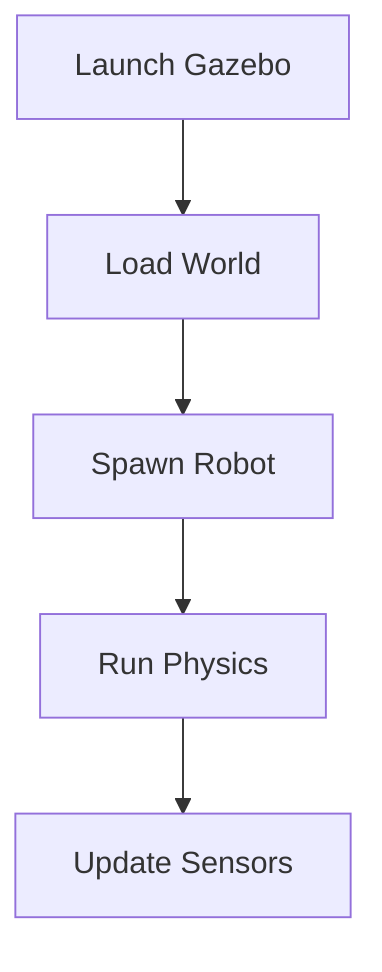

# Data Model: Chapters 3, 4, and 5

**Feature**: 003-chapters-3-4-5
**Date**: 2025-11-30
**Purpose**: Define content structure entities for simulation chapters

---

## Overview

This document defines the data entities for Chapters 3, 4, and 5. These are **content entities** (not database models), describing the structure of educational material in Markdown format.

**Note**: This feature creates static content only. Backend models (Chapter, ContentChunk, etc.) already exist from feature 001-humanoid-chapter2 and will be reused for RAG integration in a future feature.

---

## 1. Chapter

Represents a complete chapter in the textbook.

**Attributes**:
- `id` (int): Chapter number (3, 4, or 5)
- `title` (string): Full chapter title
  - Chapter 3: "Robot Simulation Fundamentals"
  - Chapter 4: "ROS 2 Integration for Robotics"
  - Chapter 5: "Advanced AI-Powered Simulation"
- `slug` (string): URL-friendly identifier (e.g., "chapter3", "chapter4", "chapter5")
- `sidebar_position` (int): Order in Docusaurus sidebar (3, 4, 5)
- `description` (string): SEO description (< 160 chars)
- `keywords` (list[string]): SEO keywords
- `tags` (list[string]): Classification tags (e.g., ["simulation", "ros2", "gazebo"])
- `difficulty` (string): "intermediate" or "advanced"
- `estimated_time` (int): Reading time in minutes (60-90)
- `sections` (list[Section]): Ordered list of section files

**File Structure**:
```
frontend/docs/chapterN/
├── index.md          # Chapter landing page (frontmatter + overview)
├── section1.md       # Individual section content
├── section2.md
└── section3.md
```

**Frontmatter Example (index.md)**:
```yaml
---
title: "Robot Simulation Fundamentals"
sidebar_position: 3
description: "Learn to simulate humanoid robots using Gazebo, model sensors, and understand physics engines."
keywords: ["gazebo", "simulation", "urdf", "physics engines", "sensor modeling"]
tags: ["chapter3", "simulation", "gazebo"]
difficulty: "intermediate"
estimated_time: 75
---
```

**Relationships**:
- Chapter **has many** Sections
- Chapter **has many** CodeExamples
- Chapter **has many** Diagrams
- Chapter **has many** Citations

---

## 2. Section

Represents a major section within a chapter.

**Attributes**:
- `id` (string): Unique identifier (e.g., "chapter3-simulation-fundamentals")
- `chapter_id` (int): Parent chapter number (3, 4, or 5)
- `title` (string): Section heading
- `filename` (string): Markdown file name (e.g., "simulation-fundamentals.md")
- `order` (int): Display order within chapter
- `word_count` (int): Approximate word count (1000-2000)
- `subsections` (list[Subsection]): Ordered list of subsections (H2/H3 headings)
- `code_examples` (list[CodeExample]): Embedded code blocks
- `diagrams` (list[Diagram]): Referenced images
- `citations` (list[Citation]): External links

**Example Structure**:
```markdown
# Section Title

## Subsection 1

Content with **inline code** and [links](#).

### Sub-subsection 1.1

More detailed content.

## Subsection 2

Content with code examples:

```python
# Code example here
```


```

**Relationships**:
- Section **belongs to** Chapter
- Section **has many** Subsections
- Section **has many** CodeExamples

---

## 3. Subsection

Represents a subsection (H2 or H3 heading) within a section.

**Attributes**:
- `id` (string): Unique identifier
- `section_id` (string): Parent section ID
- `title` (string): Subsection heading text
- `level` (int): Heading level (2 or 3)
- `order` (int): Display order within section
- `content` (string): Markdown content (paragraphs, lists, tables)

**Example**:
```markdown
## Why Simulation Matters

Simulation allows roboticists to test algorithms safely and quickly. Key benefits:

- **Safety**: Test dangerous scenarios without risk
- **Speed**: Iterate 100x faster than real-time
- **Cost**: No hardware damage or wear
```

---

## 4. CodeExample

Represents an executable code block.

**Attributes**:
- `id` (string): Unique identifier
- `chapter_id` (int): Parent chapter
- `section_id` (string): Parent section
- `title` (string): Short description (e.g., "Launch Gazebo with Humanoid Model")
- `language` (string): Programming language ("python", "cpp", "bash", "yaml")
- `code` (string): Full source code
- `line_count` (int): Number of lines
- `has_output` (boolean): Whether example shows expected output
- `expected_output` (string, optional): Example output text
- `dependencies` (list[string]): Required packages/libraries
- `execution_time` (string): Estimated runtime (e.g., "< 1 sec", "30 sec")

**Example (Chapter 3)**:
```python
"""
Title: Launch Gazebo with Humanoid Robot
Description: Spawn a URDF model in Gazebo Harmonic
Dependencies: gz-sim, python3-gz-transport
"""

import subprocess
from pathlib import Path

def launch_gazebo_with_robot(urdf_path: Path) -> None:
    """
    Launch Gazebo and spawn a robot from URDF.

    Parameters
    ----------
    urdf_path : Path
        Path to URDF file

    Examples
    --------
    >>> launch_gazebo_with_robot(Path("humanoid.urdf"))
    # Gazebo window opens with robot
    """
    subprocess.run(["gz", "sim", "-r", str(urdf_path)])

if __name__ == "__main__":
    launch_gazebo_with_robot(Path("/path/to/humanoid.urdf"))
```

**Relationships**:
- CodeExample **belongs to** Section
- CodeExample **belongs to** Chapter

---

## 5. Diagram

Represents a visual aid (SVG, PNG, or Mermaid diagram).

**Attributes**:
- `id` (string): Unique identifier
- `chapter_id` (int): Parent chapter
- `title` (string): Diagram caption/title
- `filename` (string): Image file name (e.g., "gazebo-architecture.svg")
- `path` (string): Full path ("/img/chapter3/gazebo-architecture.svg")
- `format` (string): Image format ("svg", "png", "mermaid")
- `alt_text` (string): Accessibility description
- `width` (int, optional): Display width in pixels
- `description` (string): Long description for context

**Example (SVG)**:
```markdown


*Figure 3.1: Gazebo architecture showing Server, Client, and Plugin layers.*
```

**Example (Mermaid)**:
````markdown

````

**Relationships**:
- Diagram **belongs to** Chapter
- Diagram **referenced by** multiple Sections

---

## 6. Citation

Represents an external reference or link.

**Attributes**:
- `id` (string): Unique identifier
- `chapter_id` (int): Parent chapter
- `title` (string): Link text or resource name
- `url` (string): Full URL
- `type` (string): Citation type ("official_docs", "paper", "tutorial", "video")
- `source` (string): Organization/publisher (e.g., "Gazebo", "ROS 2", "NVIDIA")
- `accessed_date` (date): When link was verified
- `status` (string): Link status ("live", "archived", "broken")

**Example**:
```markdown
For installation instructions, see the [official Gazebo documentation](https://gazebosim.org/docs/harmonic/getstarted).

```

**Relationships**:
- Citation **belongs to** Chapter
- Citation **referenced by** multiple Sections

---

## Entity Relationships Summary

```
Chapter (1)
  ├── Sections (many)
  │     ├── Subsections (many)
  │     ├── CodeExamples (many)
  │     └── Citations (many)
  ├── Diagrams (many)
  └── Citations (many)
```

---

## Chapter-Specific Entities

### Chapter 3: Robot Simulation Fundamentals

**Sections**:
1. `simulation-fundamentals.md` (Why simulation, types, benefits)
2. `gazebo-setup.md` (Installation, hello world, GUI)
3. `physics-engines.md` (ODE, Bullet, DART comparison)
4. `sensor-modeling.md` (Camera, LiDAR, IMU, force/torque)

**CodeExamples**: 3 minimum
- Launch Gazebo with humanoid (Python, 20 lines)
- Read sensor data from simulation (Python, 30 lines)
- Apply joint torques to robot (Python, 25 lines)

**Diagrams**: 3
- `gazebo-architecture.svg` (Server/Client/Plugin layers)
- `urdf-tree.svg` (Robot link/joint hierarchy)
- `physics-comparison.svg` (ODE vs. Bullet vs. DART trade-offs)

### Chapter 4: ROS 2 Integration for Robotics

**Sections**:
1. `ros2-architecture.md` (Nodes, topics, services, actions, DDS)
2. `ros2-control.md` (Hardware abstraction, controller manager)
3. `gazebo-ros2-integration.md` (gz_ros2_control, spawning)
4. `moveit2.md` (Motion planning, reaching task)

**CodeExamples**: 5 minimum
- Create ROS 2 node (Python, 15 lines)
- Publisher to /joint_commands (Python, 20 lines)
- Subscriber to /camera/image_raw (Python, 25 lines)
- Service client example (Python, 30 lines)
- Action server example (Python, 40 lines)

**Diagrams**: 3
- `ros2-graph.svg` (Node, topic, service visualization)
- `dds-architecture.svg` (DDS middleware layers)
- `moveit2-pipeline.svg` (Planning pipeline: scene → planner → trajectory)

### Chapter 5: Advanced AI-Powered Simulation

**Sections**:
1. `isaac-sim.md` (Omniverse, USD, PhysX 5, RTX, Isaac ROS)
2. `domain-randomization.md` (Sim-to-real, randomization techniques)
3. `isaac-gym-rl.md` (Parallel envs, Stable-Baselines3)
4. `unity-ml-agents.md` (Alternative for non-NVIDIA GPUs)

**CodeExamples**: 4 minimum
- Load humanoid in Isaac Sim (Python, 30 lines)
- Configure domain randomization (Python, 40 lines)
- Collect synthetic data (Python, 35 lines)
- Train RL policy with Isaac Gym (Python, 50 lines)

**Diagrams**: 3
- `isaac-sim-workflow.svg` (Omniverse → Isaac Sim → Training pipeline)
- `domain-rand-examples.svg` (Lighting, texture, physics variations)
- `unity-ml-agents-arch.svg` (Unity → ML-Agents → Python trainer)

---

## Content Statistics (Estimated)

| Metric | Chapter 3 | Chapter 4 | Chapter 5 | Total |
|--------|-----------|-----------|-----------|-------|
| Word count | 5,000 | 6,000 | 5,500 | 16,500 |
| Sections | 4 | 4 | 4 | 12 |
| Code examples | 3 | 5 | 4 | 12 |
| Diagrams (SVG) | 3 | 3 | 3 | 9 |
| Citations | 5+ | 8+ | 6+ | 19+ |
| Estimated reading time | 75 min | 90 min | 80 min | 4 hours |

---

## File Naming Conventions

**Markdown files**:
- Chapters: `chapterN/index.md` (landing page)
- Sections: `chapterN/section-name.md` (kebab-case)

**Images**:
- SVG diagrams: `img/chapterN/diagram-name.svg` (kebab-case)
- Screenshots: `img/chapterN/screenshot-name.png`

**Code files** (if separate):
- Python: `examples/chapterN/example_name.py` (snake_case)
- C++: `examples/chapterN/example_name.cpp`

---

## Validation Rules

**Chapter**:
- Title must be unique
- Sidebar position must not conflict with existing chapters
- Estimated time must be 60-120 minutes

**Section**:
- Filename must match pattern `[a-z-]+\.md`
- Word count must be 800-2500 words
- Must have at least 2 subsections

**CodeExample**:
- Must be executable (syntax valid)
- Must include docstring with Parameters, Returns, Examples
- Dependencies must be installable via apt or pip

**Diagram**:
- SVG preferred over PNG (scalability)
- Alt text required (accessibility)
- File size < 500 KB

**Citation**:
- URL must be live (validated during build)
- Prefer official documentation over blog posts
- Include access date

---

**Data Model Complete**: 2025-11-30
